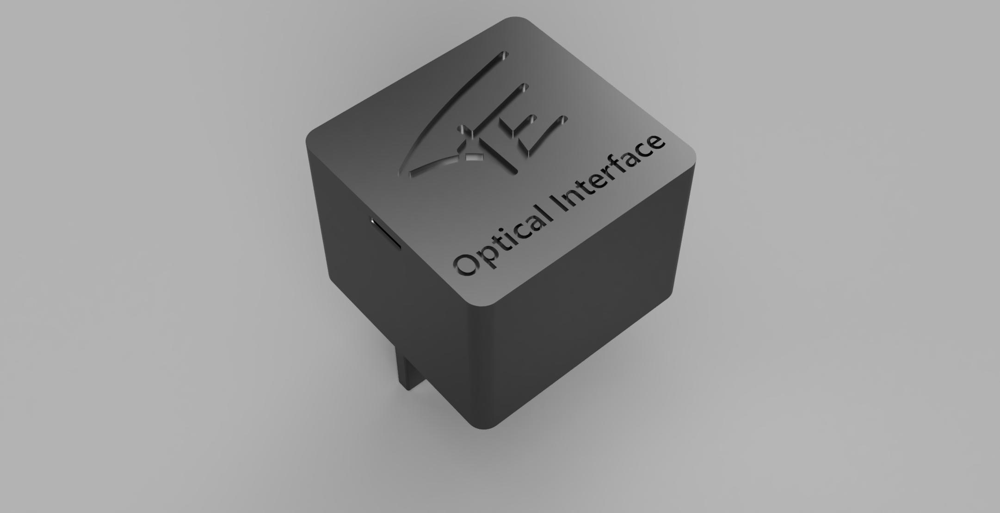
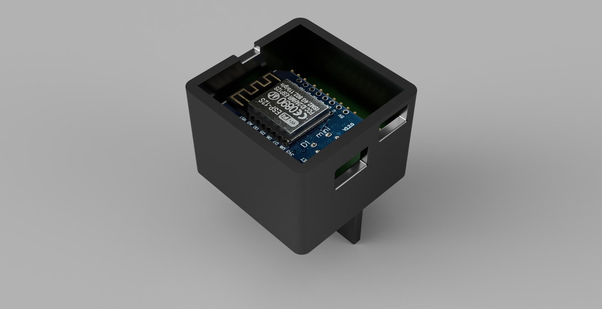
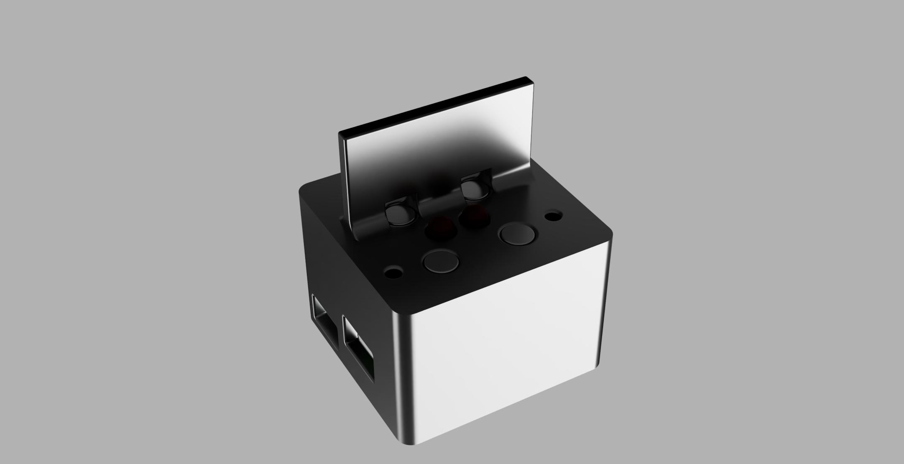

# Hardware for use with ESPHome and Kamstrup Multical 403

This repository contains a PCB and housing that can be used as the hardware to read the measurements from a Kamstrup Multical 403.
The PCB uses a 'D1 Mini' ESP8266 board. A software component for use in [ESPHome](https://esphome.io/) has been created.

Using this setup you can read measurements from the Kamstrup Multical (e.g. city heating) and publish the measurements to 
[Home Assistant](https://www.home-assistant.io/).

## Electronics
The Kamstrup Multical 403 uses an optical interface for communication. A PCB was designed that uses a mini-D1 ESP8266 board. The 
[PCB Gerbers](Electronics/PCB%20Gerbers) folder contains the 
required files to fabricate the PCB. The [PCB Components](Electronics/PCB%20Components) folder contains the BOM (bill of materials) and the component placement files. A special version for use with [JLCBCB](https://jlcpcb.com/) has been created for these.

The PCB has the following features:
- Optical interface for use with the Kamstrup meter
- Pulse counter (can be used with a proximity sensor to measure water consumption)
- 2 free open collector outputs
- 2 free inputs

### What you need
- Order (or build) the PCB with the transistors and resistors
- [IR LED 940 nm](https://www.amazon.com/HiLetgo-Infrared-Emitter-Receiver-Emission/dp/B00M1PN5TK)
- [IR Photo Diode 940 nm](https://www.amazon.com/HiLetgo-Infrared-Emitter-Receiver-Emission/dp/B00M1PN5TK)
- [D1 Mini ESP8266 board](https://www.amazon.com/Organizer-ESP8266-Internet-Development-Compatible/dp/B081PX9YFV)
- Optional: [Header pins](https://www.amazon.com/MCIGICM-Header-2-45mm-Arduino-Connector/dp/B07PKKY8BX)

### Images

## Housing

The housing can be 3D printed with a regular 3D printer. The [Fusion 360](Housing/Fusion-360) design and [STL](Housing/STL) files are provided.

The Kamstrup Multical 40x meter needs to be waken up by pressing a button. It then stays awake for a few minutes. To keep the meter awake, magnets must be placed 
in the 4 holes. Every hole fits 2 magnets (using a total of 8).

### What you need
- PCB printer to print the 2 STL files (housing and lid)
- 8x [6x3 mm neodymium magnets](https://www.amazon.com/MIN-Neodymium-Small-Magnets-6mm/dp/B096LZNZTQ)

### Images

## Software

A new component for use with ESPHome has been created and a pull request is pending. When the pull request is merged, you can add the required config to your ESPHome configuration to use the component.

Until that time, you can use the external component in your configuration file. Refer to this 
[GitHub repo](https://github.com/cfeenstra1024/esphome/tree/kamstrup_mc40x_temp#readme) 
for an example configuration file. [Documentation](https://deploy-preview-2551--esphome.netlify.app/components/sensor/kamstrup_mc40x.html) 
for the component is also available.
